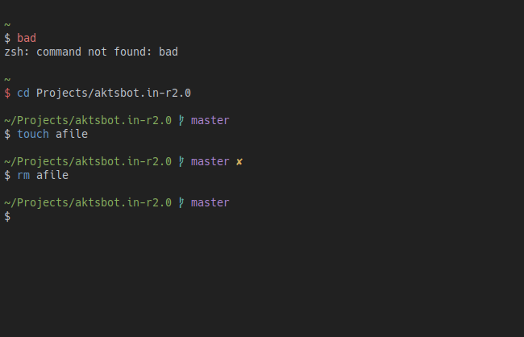

<h1 align="center">Rusty 🛠 - A material inspired zsh prompt</h1>

## Install

For [Oh My Zsh](https://github.com/robbyrussell/oh-my-zsh),

- Copy over the [theme file](rusty.zsh-theme) to `$HOME/.oh-my-zsh/custom/themes`.
- Then in your `$HOME/.zshrc` file, change the line `ZSH_THEME="xyz"` to `ZSH_THEME="rusty"`.
- Open a new terminal and you're ready to roll.

## Inspiration &amp; Credits

- [Diki Ananta](https://dikiaap.id/) has a pretty sweet zsh theme called [oxide](https://github.com/dikiaap/dotfiles/blob/master/.oh-my-zsh/themes/oxide.zsh-theme), but I kinda ran into problems with it not detecting file additions, when in a git repo. I "borrowed" the prompt structure and colors from him.
- [Robby Russel's](https://github.com/robbyrussell/) default [oh-my-zsh prompt](https://github.com/robbyrussell/oh-my-zsh/blob/master/themes/robbyrussell.zsh-theme) is just the right amount of kung fu for me. The theme file structure is again, "borrowed" from him.
- The name Rusty comes from [Colt Steele's](https://www.udemy.com/the-web-developer-bootcamp/) mutant dog ❤ 🐶. I took his course and the dog decided to stay 😊.

## License

[WTFPL](http://www.wtfpl.net/) 📦 [~akts](https://www.aktsbot.in/)
